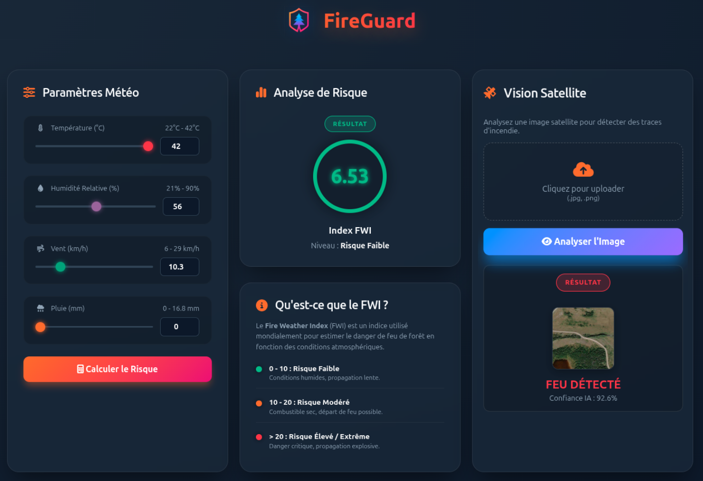
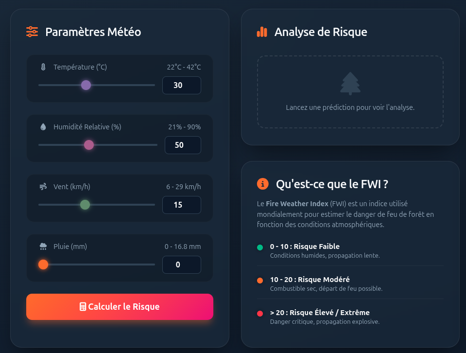
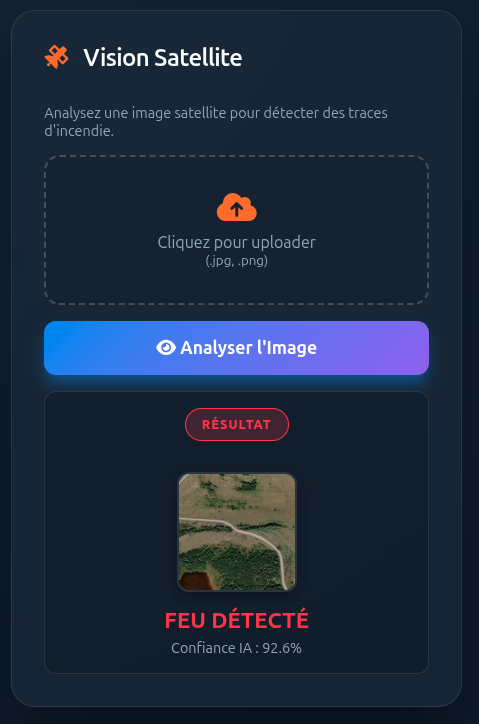

# 🔥 FireGuard: AI-Powered Forest Fire Prediction System


**FireGuard** is an intelligent, dual-module application designed to assess forest fire risks using Machine Learning and Computer Vision. It combines meteorological data analysis with satellite imagery processing to provide a comprehensive tool for early warning and detection systems.

---

## 📸 Application Preview

<p align="center">
  
</p>

---

## 🚀 Project Overview

Forest fires are a global crisis, causing irreversible damage to ecosystems and human settlements. **FireGuard** tackles this problem through two distinct AI approaches:

1.  **Preventive Risk Analysis (Regression):** Uses meteorological data (Temperature, Humidity, Wind, Rain) to predict the **Fire Weather Index (FWI)**. This helps in understanding the *probability* of a fire starting.
2.  **Active Fire Detection (Computer Vision):** Uses a Convolutional Neural Network (CNN) to analyze satellite imagery and detect if a specific area is *currently* on fire.

### ✨ Key Features
*   **User-Friendly Interface:** A modern, glassmorphism-styled web dashboard.
*   **Real-time FWI Calculation:** Instant feedback on fire risk levels based on user inputs.
*   **Satellite Image Analysis:** Upload capabilities for `.jpg` or `.png` satellite images with immediate classification.
*   **Visual Feedback:** Dynamic color-coding (Green/Orange/Red) indicating safety or danger levels.

---

## 🛠️ Tech Stack

| Component | Technology | Description |
| :--- | :--- | :--- |
| **Frontend** | HTML5, CSS3, JS | Responsive design with Glassmorphism UI. |
| **Backend** | Flask (Python) | Lightweight server handling routing and model inference. |
| **ML Engine** | Scikit-Learn | Regression model for FWI prediction. |
| **DL Engine** | TensorFlow/Keras | CNN architecture for image classification. |
| **Data Proc.** | Pandas, NumPy | Data cleaning and matrix manipulation. |
| **Imaging** | Pillow (PIL) | Image processing for the vision module. |

---

## 🏗️ Project Architecture

```text
forest-fire-prediction/
│
├── application/             # Main Application Folder
│   ├── static/              # CSS, JS, and Assets
│   │   ├── style.css
│   │   └── script.js
│   ├── templates/           # HTML Files
│   │   └── home.html
│   └── app.py               # Flask Entry Point
│
├── artifacts/               # Serialized Models
│   ├── model.pkl            # Regression Model (FWI)
│   ├── scaler.pkl           # Standard Scaler
│   └── wildfire_model_64x64.h5 # CNN Vision Model
│
├── datasets/                # Raw & Cleaned Data
├── notebooks/               # Jupyter/Colab Notebooks for Training
├── requirements.txt         # Project Dependencies
└── README.md                # Documentation
```

---

## 🧠 Model Details

### 1. Meteorological Prediction (FWI)
*   **Dataset:** [Algerian Forest Fires Dataset (UCI/Kaggle)](https://www.kaggle.com/datasets/nitinchoudhary012/algerian-forest-fires-dataset).
*   **Preprocessing:** Cleaning of "split" regions, handling typos, feature selection (Temp, RH, Ws, Rain).
*   **Algorithm:** Ridge Regression / Random Forest (Optimized via GridSearchCV).
*   **Target:** Predicts the *Fire Weather Index (FWI)* value.

<p align="center">
  
</p>

### 2. Satellite Vision (CNN)
*   **Dataset:** [Wildfire Prediction Dataset](https://www.kaggle.com/datasets/abdelghaniaaba/wildfire-prediction-dataset) (Canada/Quebec).
*   **Architecture:** Custom Convolutional Neural Network (CNN).
    *   Input: 64x64 pixels.
    *   Layers: Conv2D -> MaxPooling -> BatchNorm -> Dropout -> Dense.
*   **Performance:** ~93-95% Accuracy on test data.

<p align="center">
  
</p>

---

## 💻 Installation & Usage

Follow these steps to run the application locally.

### Prerequisites
*   Python 3.8 or higher installed.
*   Git (optional, for cloning).

### Step 1: Clone the Repository
```bash
git clone https://github.com/your-username/FireGuard.git
cd FireGuard
```

### Step 2: Create a Virtual Environment
It is recommended to use a virtual environment to avoid conflicts.

*   **Windows:**
    ```bash
    python -m venv venv
    .\venv\Scripts\activate
    ```
*   **Mac/Linux:**
    ```bash
    python3 -m venv venv
    source venv/bin/activate
    ```

### Step 3: Install Dependencies
```bash
pip install -r requirements.txt
```

### Step 4: Run the Application
Navigate to the application folder and start the Flask server.

```bash
cd application
python app.py
```

### Step 5: Access the Dashboard
Open your web browser and go to:
`http://127.0.0.1:5000/`

---

## 📊 Data Sources & Credits

*   **Algerian Forest Fires Dataset:** Donated by Faroudja Abid et al. (University of Tizi-Ouzou).
*   **Wildfire Prediction Dataset:** Created by Abdelghani Aaba, sourced from Canada's Open Government Portal.

---

## 🔮 Future Improvements

*   Integration of a real-time Weather API (OpenWeatherMap) to fetch live data automatically.
*   Deployment to a cloud platform (Render, AWS, or Azure).
*   Expansion of the CNN model to include a "Smoke" detection class.

---

<p align="center">
  Made with ❤️ for the AI Mini-Project
</p>
